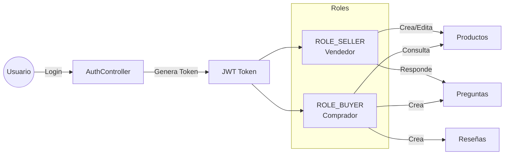
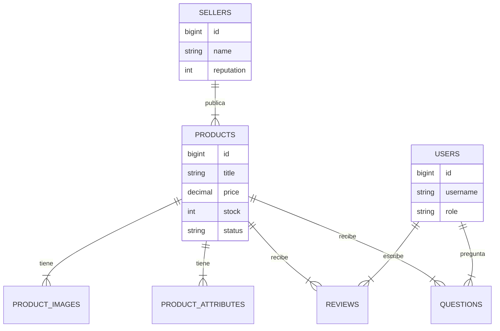

# MercadoLibre Product Details API

Una API RESTful robusta y escalable inspirada en el backend de MercadoLibre, construida con **Spring Boot 3** y **Java 21**. Este proyecto demuestra prácticas modernas de ingeniería de software, patrones de diseño y una arquitectura limpia.

## 🌟 Características Principales
- **Gestión de Productos Completa:** CRUD de productos, imágenes, atributos, preguntas y reseñas.
- **Seguridad JWT:** Autenticación robusta con roles (Comprador/Vendedor) y lista negra de tokens (Logout).
- **Observabilidad:** Integración con OpenTelemetry, Micrometer y Grafana.
- **Calidad de Código:** Configuración lista para SonarQube.
- **Documentación Viva:** Swagger UI con ejemplos interactivos.
- **Resiliencia:** Circuit Breakers implementados con Resilience4j.

---

## 🏗️ Arquitectura del Sistema

La aplicación sigue una arquitectura en capas clásica, optimizada para mantenibilidad y testabilidad.

```mermaid
graph TD
    Client[Cliente / Frontend] --> LB[Load Balancer / Ingress]
    LB --> Controller[Controller Layer<br>(REST Endpoints)]
    
    subgraph "Application Core"
        Controller --> Security[Security Filter Chain<br>(JWT Auth)]
        Controller --> Service[Service Layer<br>(Business Logic)]
        Service --> Mapper[Mappers<br>(DTO <-> Entity)]
        Service --> Resilience[Circuit Breakers<br>(Resilience4j)]
    end
    
    subgraph "Data Persistence"
        Service --> Repository[Repository Layer<br>(JPA/Hibernate)]
        Repository --> DB[(H2 Database<br>In-Memory)]
    end

    subgraph "Observability"
        Service -.-> OTEL[OpenTelemetry Collector]
        OTEL --> Grafana[Grafana / Prometheus]
    end
```

### 👥 Roles y Seguridad
El sistema utiliza JWT para autenticación stateless.



---

## 💾 Modelo de Base de Datos
Diagrama Entidad-Relación (H2 Database). Propósito de cada tabla:

- **products:** Núcleo del sistema. Almacena info base (precio, stock).
- **sellers:** Vendedores que publican productos.
- **product_images/attributes:** Detalle extendido del producto (1:N).
- **reviews:** Opiniones de usuarios sobre productos.
- **questions:** Preguntas de usuarios y respuestas de vendedores.
- **users:** Credenciales y roles para seguridad.
- **blacklisted_tokens:** Para invalidar JWTs al hacer logout.



---

## 🛠️ Patrones de Diseño Utilizados

Para una explicación detallada, ver [DESIGN_PATTERNS.md](DESIGN_PATTERNS.md).

1.  **Builder:** Creación fluida de objetos complejos (`Product.builder()...`).
2.  **Mapper:** Separación de conversión Entidad-DTO (Mantenibilidad).
3.  **Facade:** `ProductController` simplifica el acceso a múltiples servicios.
4.  **Singleton:** Gestión de Beans de Spring (Services, Repositories).
5.  **Strategy/Template:** Usado implícitamente en la seguridad y validaciones.
6.  **Dependency Injection:** Inversión de control para testabilidad.

---

## 🚀 Guía de Instalación y Ejecución

### Prerrequisitos
- Java 21
- Maven 3.8+
- Docker (Opcional, para observabilidad)

### Ejecución Local
```bash
# 1. Compilar
mvn clean install

# 2. Ejecutar
mvn spring-boot:run
```
La aplicación iniciará en `http://localhost:8080`.

---

## 🐳 Docker y Observabilidad

### 1. Grafana & OpenTelemetry (LGTM Stack)
Para levantar todo el stack de observabilidad (Logs, Traces, Metrics) en un solo comando:

```bash
docker run -p 3000:3000 -p 4317:4317 -p 4318:4318 --rm -ti grafana/otel-lgtm
```
- **Grafana:** `http://localhost:3000` (admin/admin)
- **OTEL Collector:** Puertos 4317 (gRPC) y 4318 (HTTP)

### 2. SonarQube (Calidad de Código)
Para análisis estático de código local:

```bash
docker run --name sonarqube-custom -p 9000:9000 sonarqube:community
```
- **URL:** `http://localhost:9000` (admin/admin)

#### Configuración del Token de SonarQube:
1.  Loguéate en SonarQube (`admin`/`admin`, cambia la clave si te pide).
2.  Ve a **My Account** (Icono de usuario arriba a la derecha) → **Security**.
3.  En la sección **Tokens**, pon un nombre (ej: `dev-local-token`) y selecciona "Global Analysis Token".
4.  Haz clic en **Generate**.
5.  **¡Copia el token!** Lo necesitarás para ejecutar el análisis:
    ```bash
    mvn clean verify sonar:sonar -Dsonar.token=TU_TOKEN_AQUI
    ```

---

## 📚 Documentación de API (Swagger)

Una vez iniciada la aplicación, accede a la documentación interactiva:
👉 **[http://localhost:8080/swagger-ui/index.html](http://localhost:8080/swagger-ui/index.html)**

### Endpoints Principales

| Método | Endpoint | Descripción | Rol Requerido |
|--------|----------|-------------|---------------|
| `POST` | `/api/auth/login` | Iniciar sesión (Obtener JWT) | Público |
| `POST` | `/api/auth/logout` | Cerrar sesión | Autenticado |
| `GET` | `/api/products` | Listar productos | Público |
| `GET` | `/api/products/{id}` | Detalle de producto | Público |
| `POST` | `/api/products` | Crear producto | **Seller** |
| `POST` | `/api/products/{id}/reviews` | Dejar reseña | **Buyer** |
| `POST` | `/api/products/{id}/questions` | Preguntar | **Buyer** |

---

## 🧪 Datos de Prueba (Usuarios)

La base de datos H2 se carga automáticamente con datos de prueba (`data.sql`).

| Usuario | Contraseña | Rol |
|---------|------------|-----|
| `seller`| `password` | Vendedor |
| `buyer` | `password` | Comprador |

Usa estas credenciales en el endpoint `/api/auth/login` para obtener tu token Bearer.
